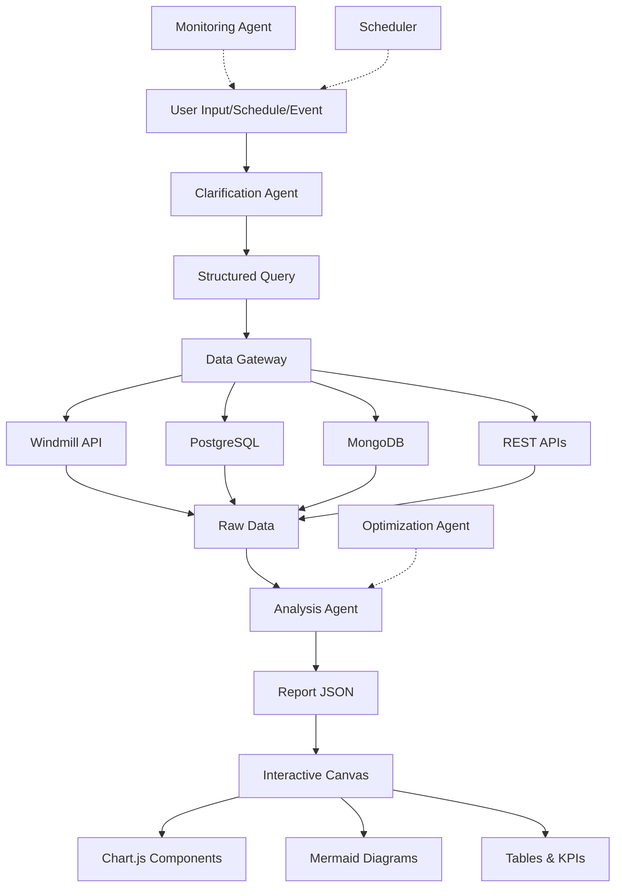

# AI Report Generator - Brainstorm Session Summary

**Date**: 2026-01-07
**Session Type**: Interactive Requirements Discovery
**Outcome**: Complete system design with GitHub issues ready for implementation

---

## 🎯 System Vision

**Autonomous AI-Driven Reporting Platform** with:
- Drag-drop interactive report canvas
- All Chart.js visualizations + Mermaid diagrams
- Multi-agent AI system (clarification, analysis, monitoring, optimization)
- Scheduled & event-driven autonomous report generation
- Pluggable data gateway for custom data sources
- Full report versioning and history

---

## 📊 Complete Data Flow



---

## 🏗️ System Architecture

### Core Components

1. **Report Canvas** (Frontend)
   - 12-column grid-based drag-drop system
   - All Chart.js chart types supported
   - Mermaid diagrams for flowcharts
   - Tables, KPI cards, markdown text
   - Temporary layout customization

2. **AI Agent System** (Backend)
   - **Clarification Agent**: Natural language → Structured query
   - **Analysis Agent**: Raw data → Report JSON
   - **Monitoring Agent**: Anomaly detection & event watching
   - **Optimization Agent**: Learns from user behavior
   - **Orchestrator**: Coordinates multi-agent workflows

3. **Data Gateway** (Backend)
   - Pluggable data source architecture
   - Initial sources: Windmill, PostgreSQL, MongoDB, REST APIs
   - User-defined custom connectors
   - Multi-source query aggregation

4. **Scheduling Engine** (Backend)
   - Cron-based scheduled reports
   - Event-driven triggers
   - Anomaly detection auto-triggers
   - User-defined business rules

5. **Report Management** (Backend + Frontend)
   - Full version history
   - Search and filtering
   - Dashboard view
   - PDF export
   - Favorites/bookmarks

---

## 📋 Report JSON Schema

Comprehensive schema defined in `docs/report-schema.md`:

```typescript
interface Report {
  version: string;
  id: string;
  title: string;
  description?: string;
  generatedAt: string;
  layout: LayoutConfig;        // 12-column grid
  components: Component[];     // Chart, KPI, Table, Markdown, Mermaid, Image
  metadata?: ReportMetadata;
}
```

**Component Types**:
- **Chart**: All Chart.js types (line, bar, pie, doughnut, polarArea, radar, scatter, bubble, mixed)
- **KPI**: Large metric displays with trends
- **Table**: Data tables with sorting/filtering/pagination
- **Markdown**: Rich text content
- **Mermaid**: Flowcharts, sequence diagrams, ERDs
- **Image**: Display images with captions

---

## 🎯 GitHub Repository

**Repository**: `https://github.com/Wolfschanze-Berlin/ai-report-generator`

### Milestones Created

1. **M1: Foundation & Core Infrastructure** - 5 issues
   - TypeScript types, Windmill integration, data gateway foundation

2. **M2: Reporting Canvas & Visualization** - 8 issues
   - Grid system, all Chart.js components, Mermaid, tables, KPIs

3. **M3: AI Agent System** - 6 issues
   - Agent architecture, clarification, analysis, monitoring, optimization agents

4. **M4: Scheduling & Automation** - 5 issues
   - Cron scheduling, event triggers, anomaly detection, rules engine

5. **M5: Data Gateway & Custom Sources** - 6 issues
   - Plugin architecture, PostgreSQL, MongoDB, REST API connectors

6. **M6: Report Management & History** - 7 issues
   - Versioning, storage, search, dashboard, export

**Total**: 37 core issues + 6 future enhancements

---

## 🚀 Key Issues Created

### M1: Foundation (5 issues)
- [#1] Setup TypeScript types for Report JSON Schema
- [#2] Implement Windmill API Client
- [#3] Create Windmill Server Action
- [#4] Setup Data Gateway Foundation
- [#5] Create Project Documentation Structure

### M2: Canvas & Visualization (3 issues created)
- [#6] Implement Grid-Based Drag-Drop Canvas
- [#7] Create Chart.js Component Wrapper (All Chart Types)
- [#8] Implement Mermaid Diagram Component

### M3: AI Agents (2 issues created)
- [#9] Design AI Agent Architecture
- [#10] Implement Analysis Agent (Data → Report JSON)

**Remaining 27 issues** documented in `docs/github-issues.md` for batch creation.

---

## 🔑 Critical Technical Decisions

### 1. Data Flow Architecture
- **Windmill Integration**: Primary data source via OpenSearch aggregation
- **60-second timeout**: Server action times out but job continues in background
- **Structured queries**: AI agent produces OpenSearch query objects
- **Raw data → AI analysis → Report JSON**: Separate server actions

### 2. Report Rendering
- **Schema-driven**: AI agent outputs JSON, frontend renders dynamically
- **Grid-based layout**: 12 columns, 80px row height, 16px gap
- **Temporary customization**: Users can rearrange but not save layouts
- **All Chart.js types**: Complete support for every chart type

### 3. AI Agent Design
- **Multi-agent system**: 4 specialized agents + orchestrator
- **Autonomous operation**: Scheduled, event-driven, and anomaly-triggered
- **LLM-powered**: Uses OpenAI/Anthropic for intent understanding and analysis
- **Learning system**: Optimization agent improves over time

### 4. Data Gateway
- **Pluggable architecture**: Interface-based data source plugins
- **User-defined sources**: Users can connect their own databases/APIs
- **Multi-source aggregation**: Query multiple sources in one report

### 5. Report Management
- **Full versioning**: Store every report version
- **In-app only**: No email/Slack notifications (simplified scope)
- **Search & filter**: Full-text search, date range, tags, data source filters
- **PDF export**: Server-side generation preserving layout

---

## 📝 Documentation Created

1. **`docs/report-schema.md`** - Complete Report JSON Schema specification
2. **`docs/github-issues.md`** - Comprehensive issue tracking document (43 issues)
3. **`docs/BRAINSTORM_SUMMARY.md`** - This file (session summary)

**Pending Documentation** (Issue #5):
- `docs/architecture.md` - System architecture overview
- `docs/data-flow.md` - Data flow diagrams
- `docs/api-reference.md` - API documentation
- `docs/development-guide.md` - Local setup instructions
- `docs/deployment.md` - Deployment instructions
- `docs/ai-agents.md` - AI agent architecture (Issue #9)
- `docs/data-gateway.md` - Data gateway plugin architecture (Issue #25)

---

## 🎬 Next Steps

### Immediate Actions
1. **Review Issues**: Prioritize and refine issue descriptions if needed
2. **Team Assignment**: Assign issues to team members
3. **Set Milestone Dates**: Define target dates for each milestone
4. **Create Remaining Issues**: Batch create the 27 remaining issues from `docs/github-issues.md`

### Development Start (M1: Foundation)
1. Setup TypeScript types (#1)
2. Implement Windmill API client (#2)
3. Create server action for Windmill (#3)
4. Design data gateway foundation (#4)
5. Complete project documentation (#5)

### Parallel Workstreams
- **Frontend Team**: Can start on M2 (Canvas) after #1 is complete
- **Backend Team**: M1 → M3 (AI Agents) → M4 (Scheduling)
- **Data Team**: M5 (Data Gateway) can start in parallel with M3
- **DevOps Team**: Setup CI/CD, deployment, monitoring

---

## 🤝 Key Requirements Clarified

### User Interactions
- ✅ Users can drag-drop components to customize layout
- ✅ Layout changes are temporary (not saved)
- ✅ Users can define custom data sources
- ✅ Users can schedule reports (cron-based)
- ✅ Users can create business rules for auto-triggering

### AI Agent Behavior
- ✅ Clarification agent understands natural language
- ✅ Analysis agent generates complete Report JSON
- ✅ Monitoring agent watches for anomalies/events
- ✅ Optimization agent learns from user behavior
- ✅ All agents work autonomously with orchestration

### Data & Storage
- ✅ Windmill as primary data source initially
- ✅ Pluggable architecture for custom sources
- ✅ Full report version history
- ✅ In-app notifications only (no email/Slack)
- ✅ PDF export with layout preservation

### Visualization
- ✅ ALL Chart.js chart types supported
- ✅ Mermaid diagrams for flowcharts/ERDs
- ✅ Data tables with sorting/filtering
- ✅ KPI cards with trends
- ✅ Markdown text sections

---

## 🎉 Brainstorm Outcome

**Status**: ✅ **Complete and Ready for Implementation**

**Deliverables**:
- ✅ Complete system architecture defined
- ✅ Report JSON Schema documented
- ✅ GitHub repository created
- ✅ 6 milestones created
- ✅ 10 critical issues created
- ✅ 37 total issues documented
- ✅ Technical decisions documented
- ✅ Data flow architecture defined

**Ready to Start**: M1 Foundation issues are ready for development!

---

## 📞 Contact & Collaboration

**Repository**: https://github.com/Wolfschanze-Berlin/ai-report-generator
**Organization**: Wolfschanze-Berlin
**Project Type**: Autonomous AI Reporting Platform

**Tech Stack**:
- Frontend: Next.js 16, React 19, TypeScript, Chart.js, Mermaid
- Backend: Next.js Server Actions, AI Agents (LLM-powered)
- Data: Windmill API, PostgreSQL, MongoDB, REST APIs
- Infrastructure: Vercel/AWS, Job Queue (Bull/BullMQ)

---

🧠 **Generated from interactive brainstorm session** - 2026-01-07
