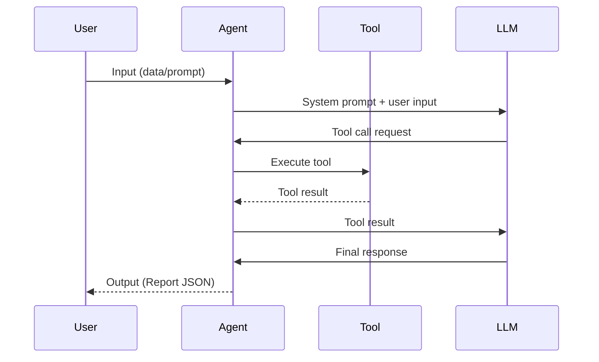
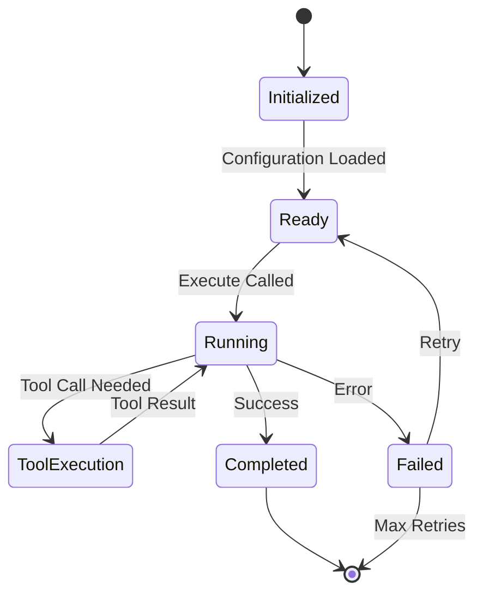

# AI Agent Architecture

**Version**: 1.0
**Last Updated**: 2026-01-07
**SDK**: [Claude Agent SDK TypeScript v2](https://platform.claude.com/docs/en/agent-sdk/typescript-v2-preview)

## Overview

The AI Report Generator uses the Claude Agent SDK to implement autonomous agents that transform raw data into meaningful reports. This architecture enables intelligent, scalable, and maintainable report generation with minimal human intervention.

## Architecture Principles

1. **Agent Autonomy**: Each agent operates independently with clear responsibilities
2. **Type Safety**: Full TypeScript support with Zod schema validation
3. **Observability**: Comprehensive logging and monitoring
4. **Composability**: Agents can be orchestrated for complex workflows
5. **Error Resilience**: Graceful degradation and recovery mechanisms

## Agent Types

### 1. Analysis Agent (Data → Report JSON)

**Purpose**: Transform raw OpenSearch data into structured Report JSON

**Input**: Raw data array from Windmill
**Output**: Complete `Report` object matching [report-schema.md](./report-schema.md)

**Responsibilities**:
- Parse and validate raw data
- Identify data patterns and trends
- Select appropriate chart types
- Generate insights and summaries
- Create optimal component layout
- Generate complete Report JSON

**Tools**:
- Windmill Client (data fetching)
- LLM (Claude) for analysis and generation
- Zod validation for output schema

### 2. Clarification Agent (User Intent → Query)

**Purpose**: Understand user intent and generate structured queries

**Input**: Natural language prompt from user
**Output**: Structured OpenSearch query object

**Responsibilities**:
- Parse natural language intent
- Handle ambiguous queries
- Ask clarifying questions when needed
- Generate valid OpenSearch queries
- Validate query structure

**Tools**:
- LLM (Claude) with function calling
- Query validation library
- User interaction prompts

### 3. Monitoring Agent (Data Watching)

**Purpose**: Monitor data sources for anomalies and trigger reports

**Input**: Data source configuration
**Output**: Trigger events for report generation

**Responsibilities**:
- Periodic data source polling
- Anomaly detection
- Event detection (thresholds, patterns)
- Trigger report generation
- Alert logging

**Tools**:
- Windmill Client (data polling)
- Statistical analysis libraries
- Event queue system

### 4. Optimization Agent (Report Improvement)

**Purpose**: Learn and improve report quality over time

**Input**: User interactions and feedback
**Output**: Optimization suggestions

**Responsibilities**:
- Track user interactions
- Analyze report effectiveness
- Learn user preferences
- Suggest layout improvements
- Optimize component selection

**Tools**:
- Analytics tracking
- ML/embedding libraries
- A/B testing framework

## Agent SDK Implementation

### Base Agent Structure

Using the Claude Agent SDK v2, all agents follow this structure:

```typescript
import { Agent, AgentOptions } from '@anthropic-ai/agent-sdk';
import Anthropic from '@anthropic-ai/sdk';

// Agent configuration
const agentOptions: AgentOptions = {
  model: 'claude-3-5-sonnet-20241022',
  systemPrompt: 'Agent-specific instructions...',
  tools: [
    // Agent-specific tools
  ],
  maxTurns: 10,
  onMessage: (message) => {
    // Handle agent messages
  },
  onError: (error) => {
    // Handle errors
  },
};

// Create agent instance
const agent = new Agent(anthropicClient, agentOptions);

// Execute agent
const result = await agent.run(userMessage);
```

### Tool Definition Pattern

Tools follow the Anthropic API tool specification:

```typescript
const tool = {
  name: 'tool_name',
  description: 'What this tool does',
  input_schema: {
    type: 'object',
    properties: {
      param1: {
        type: 'string',
        description: 'Parameter description',
      },
    },
    required: ['param1'],
  },
};
```

## Analysis Agent Implementation

### Core Structure

```typescript
// src/lib/agents/analysis-agent.ts

import { Agent, AgentOptions } from '@anthropic-ai/agent-sdk';
import Anthropic from '@anthropic-ai/sdk';
import { windmillClient } from '@/lib/windmill-client';
import { reportSchema, type Report } from '@/types/report-schema';
import { z } from 'zod';

interface AnalysisAgentInput {
  data: any[]; // Raw data from Windmill
  userPrompt?: string; // Optional context from user
}

interface AnalysisAgentOutput {
  report: Report;
  metadata: {
    processingTime: number;
    dataPoints: number;
    insights: number;
  };
}

export class AnalysisAgent {
  private agent: Agent;
  private anthropicClient: Anthropic;

  constructor(apiKey?: string) {
    this.anthropicClient = new Anthropic({
      apiKey: apiKey || process.env.ANTHROPIC_API_KEY,
    });

    const agentOptions: AgentOptions = {
      model: 'claude-3-5-sonnet-20241022',
      systemPrompt: this.getSystemPrompt(),
      tools: this.getTools(),
      maxTurns: 10,
      onMessage: (message) => {
        console.log('[Analysis Agent]:', message);
      },
      onError: (error) => {
        console.error('[Analysis Agent Error]:', error);
      },
    };

    this.agent = new Agent(this.anthropicClient, agentOptions);
  }

  private getSystemPrompt(): string {
    return `You are an expert data analyst that transforms raw data into comprehensive visual reports.

Your goal is to:
1. Analyze the provided data to identify patterns, trends, and insights
2. Select the most appropriate chart types and visualizations
3. Generate KPIs that highlight key metrics
4. Create markdown summaries with actionable insights
5. Design an optimal layout for all components
6. Output a complete Report JSON that follows the schema exactly

You MUST output valid JSON that conforms to the Report schema.

Key principles:
- Choose chart types that best represent the data patterns
- KPIs should highlight the most important metrics
- Insights should be actionable and specific
- Layout should be logical and visually balanced
- Use appropriate colors and styling for clarity`;
  }

  private getTools() {
    return [
      {
        name: 'analyze_data_patterns',
        description: 'Analyze raw data to identify patterns, trends, correlations, and outliers',
        input_schema: {
          type: 'object',
          properties: {
            data: {
              type: 'array',
              description: 'Raw data array to analyze',
            },
          },
          required: ['data'],
        },
      },
      {
        name: 'suggest_chart_type',
        description: 'Suggest the best chart type for given data characteristics',
        input_schema: {
          type: 'object',
          properties: {
            dataType: {
              type: 'string',
              description: 'Type of data: time-series, categorical, numerical, etc.',
            },
            purpose: {
              type: 'string',
              description: 'Purpose: comparison, trend, distribution, relationship',
            },
          },
          required: ['dataType', 'purpose'],
        },
      },
      {
        name: 'validate_report_schema',
        description: 'Validate that the generated report matches the required schema',
        input_schema: {
          type: 'object',
          properties: {
            report: {
              type: 'object',
              description: 'Report object to validate',
            },
          },
          required: ['report'],
        },
      },
    ];
  }

  async analyze(input: AnalysisAgentInput): Promise<AnalysisAgentOutput> {
    const startTime = Date.now();

    // Prepare analysis prompt
    const prompt = `Analyze the following data and generate a comprehensive report:

DATA:
${JSON.stringify(input.data, null, 2)}

${input.userPrompt ? `USER CONTEXT:\n${input.userPrompt}\n` : ''}

Generate a complete Report JSON that includes:
1. Multiple KPI components for key metrics
2. Appropriate chart visualizations (bar, line, pie, etc.)
3. A markdown summary with insights and recommendations
4. Optimal layout with proper positioning

Output ONLY the Report JSON, no other text.`;

    // Run agent
    const result = await this.agent.run(prompt);

    // Extract and validate report JSON
    const reportJSON = this.extractReportJSON(result.content);
    const validatedReport = reportSchema.parse(reportJSON);

    return {
      report: validatedReport,
      metadata: {
        processingTime: Date.now() - startTime,
        dataPoints: input.data.length,
        insights: validatedReport.components.filter((c) => c.type === 'markdown').length,
      },
    };
  }

  private extractReportJSON(content: string): any {
    // Extract JSON from agent response (handles code blocks)
    const jsonMatch = content.match(/```json\n([\s\S]*?)\n```/) || content.match(/{[\s\S]*}/);

    if (!jsonMatch) {
      throw new Error('No JSON found in agent response');
    }

    const jsonStr = jsonMatch[1] || jsonMatch[0];
    return JSON.parse(jsonStr);
  }
}
```

### Usage Example

```typescript
import { AnalysisAgent } from '@/lib/agents/analysis-agent';
import { windmillClient } from '@/lib/windmill-client';

// Fetch data from Windmill
const query = {
  index: 'sales-data',
  query: { match_all: {} },
};

const rawData = await windmillClient.executeJob(query);

// Analyze with agent
const agent = new AnalysisAgent();
const result = await agent.analyze({
  data: rawData,
  userPrompt: 'Focus on quarterly sales trends',
});

console.log('Generated report:', result.report);
console.log('Processing time:', result.metadata.processingTime, 'ms');
```

## Agent Communication Protocol

### Message Format

Agents communicate using structured messages:

```typescript
interface AgentMessage {
  role: 'user' | 'assistant' | 'tool';
  content: string | ToolCall[];
  metadata?: {
    timestamp: Date;
    agentId: string;
    correlationId: string;
  };
}
```

### Tool Call Flow



## Error Handling Strategy

### Error Types

1. **Input Validation Errors**: Invalid data format or missing required fields
2. **Tool Execution Errors**: Tool fails to execute (API errors, timeouts)
3. **Schema Validation Errors**: Output doesn't match expected schema
4. **LLM Errors**: API failures, token limits, rate limits

### Error Recovery

```typescript
class AgentError extends Error {
  constructor(
    message: string,
    public type: 'input' | 'tool' | 'schema' | 'llm',
    public recoverable: boolean,
    public originalError?: Error
  ) {
    super(message);
    this.name = 'AgentError';
  }
}

async function executeWithRetry<T>(
  fn: () => Promise<T>,
  maxRetries: number = 3,
  backoff: number = 1000
): Promise<T> {
  for (let i = 0; i < maxRetries; i++) {
    try {
      return await fn();
    } catch (error) {
      if (i === maxRetries - 1 || !isRetryable(error)) {
        throw error;
      }
      await sleep(backoff * Math.pow(2, i));
    }
  }
  throw new Error('Max retries exceeded');
}
```

## Observability

### Logging

```typescript
interface AgentLog {
  timestamp: Date;
  agentId: string;
  level: 'debug' | 'info' | 'warn' | 'error';
  message: string;
  metadata?: Record<string, any>;
}

class AgentLogger {
  log(level: string, message: string, metadata?: any) {
    const log: AgentLog = {
      timestamp: new Date(),
      agentId: this.agentId,
      level,
      message,
      metadata,
    };

    // Send to logging service
    console.log(JSON.stringify(log));
  }
}
```

### Metrics

Track key agent metrics:

- **Execution Time**: How long each agent takes to complete
- **Success Rate**: Percentage of successful completions
- **Error Rate**: Frequency and types of errors
- **Token Usage**: LLM token consumption
- **Tool Calls**: Number and types of tool calls
- **User Satisfaction**: Feedback and ratings

## Agent Lifecycle



## Testing Strategy

### Unit Tests

Test individual agent methods and tools:

```typescript
describe('AnalysisAgent', () => {
  it('should generate valid report JSON', async () => {
    const agent = new AnalysisAgent();
    const result = await agent.analyze({
      data: mockData,
    });

    expect(result.report).toMatchSchema(reportSchema);
  });

  it('should handle empty data gracefully', async () => {
    const agent = new AnalysisAgent();

    await expect(
      agent.analyze({ data: [] })
    ).rejects.toThrow('No data provided');
  });
});
```

### Integration Tests

Test agent-to-tool integration:

```typescript
describe('AnalysisAgent Integration', () => {
  it('should fetch data from Windmill and generate report', async () => {
    const query = { /* test query */ };
    const data = await windmillClient.executeJob(query);

    const agent = new AnalysisAgent();
    const result = await agent.analyze({ data });

    expect(result.report.components.length).toBeGreaterThan(0);
  });
});
```

### E2E Tests

Test complete workflows:

```typescript
describe('Report Generation Workflow', () => {
  it('should generate report from user prompt', async () => {
    const userPrompt = 'Show me quarterly sales trends';

    // Clarification agent
    const clarificationAgent = new ClarificationAgent();
    const query = await clarificationAgent.parseIntent(userPrompt);

    // Fetch data
    const data = await windmillClient.executeJob(query);

    // Analysis agent
    const analysisAgent = new AnalysisAgent();
    const result = await analysisAgent.analyze({ data, userPrompt });

    expect(result.report).toMatchSnapshot();
  });
});
```

## Performance Optimization

### Caching Strategy

```typescript
class AgentCache {
  private cache = new Map<string, any>();
  private ttl = 5 * 60 * 1000; // 5 minutes

  async get(key: string): Promise<any | null> {
    const entry = this.cache.get(key);
    if (!entry) return null;

    if (Date.now() - entry.timestamp > this.ttl) {
      this.cache.delete(key);
      return null;
    }

    return entry.value;
  }

  set(key: string, value: any): void {
    this.cache.set(key, {
      value,
      timestamp: Date.now(),
    });
  }
}
```

### Prompt Optimization

- **Concise Instructions**: Clear, specific prompts
- **Few-Shot Examples**: Provide examples in system prompt
- **Output Format Specification**: Explicit JSON schema
- **Context Pruning**: Remove unnecessary data before sending

### Parallel Execution

```typescript
async function analyzeMultipleSources(sources: DataSource[]) {
  const agents = sources.map((source) => new AnalysisAgent());

  const results = await Promise.all(
    sources.map((source, i) =>
      agents[i].analyze({ data: source.data })
    )
  );

  return combineReports(results);
}
```

## Future Enhancements

1. **Multi-Agent Orchestration**: Coordinate multiple agents for complex workflows
2. **Streaming Responses**: Stream report generation for real-time updates
3. **Agent Learning**: Store and learn from past generations
4. **Custom Tools**: Allow users to define custom analysis tools
5. **Agent Marketplace**: Share and discover community agents
6. **Visual Agent Builder**: No-code agent configuration UI

## References

- [Claude Agent SDK TypeScript v2](https://platform.claude.com/docs/en/agent-sdk/typescript-v2-preview)
- [Anthropic API Tool Use](https://docs.anthropic.com/en/docs/build-with-claude/tool-use)
- [Report Schema Documentation](./report-schema.md)
- [Windmill API Client](../src/lib/windmill-client.ts)
